Reducing Crime in North Carolina
================
Apik Zorian, Bradley Nott, Ernesto Del Valle
12/10/2018

Abstract:
=========

In this research proposal we specify models that focus on capturing both *deterrence* and *socioeconomic* factors as predictors of crime rates in North Carolina, based on the data provided. We do this keeping the potential policy impact for the campaign trail in mind. We also address potential sources of omitted variable bias and what alternative data beyond the provided data set could mitigate these.

Structure:
==========

1.  Introduction

2.  Data Clean Up

3.  Data Exploration for Model Building

4.  Hypothesis and Proposed Model Specifications

5.  Testing CLM Assumptions

6.  Model Interpretation and Potential Policy Proposals

7.  Alternative Data

8.  Conclusion

1) Introduction:
----------------

In recent months this political campaign has had to confront the challenging issue of crime in North Carolina. Debates with other candidates, as well as interactions with local government officials, have revealed that it is essential to have a clear understanding of the determinants of crime. Once gained, a clearer picture of what influences crime will facilitate a more productive dialogue on the campaign trail and support properly directing resources to minimize crime through appropriate policy.

We realize that this lack of clarity is a key concern for the political campaign. We aim to address this concern with an analysis of crime statistics for a selection of counties in North Carolina. Our process will use available data to uncover and explain influential factors that relate to crime rates.

We will place specific emphasis on identifying factors that not only have predictive power, but also offer the most practical opportunities for decreasing crime rates from a policy perspective. We judge such factors are the most relevant to the message the campaign intends to communicate.

We will also suggest new sources of data which might serve as more accurate measures of the underlying causal relationships that we seek to understand, motivated from the data at hand. With the support of these discoveries we will generate policy suggestions that are applicable to local government.

2) Data Clean Up:
-----------------

In this section we load the data set provided and wrangle it into a "clean" format as `raw_data` for further exploration ahead. We start by importing the `crime_v2.csv` file and use the PDF codebook provided with variable descriptions as guidance:

``` r
# Importing CSV:
library(data.table)

read_path <- "/Users/apik/NC_Crime_OLS/crime_v2.csv"

raw_data <- fread(read_path,
                  na.strings = c(getOption("datatable.na.strings", c("NA", "", "[]"))))
rm(read_path)
```

Post import we perform basic exploration for deciding formatting or any data type conversions that could be convenient ahead:

``` r
# Basic data exploration for wrangling decisions:
str(raw_data)
```

    ## Classes 'data.table' and 'data.frame':   97 obs. of  25 variables:
    ##  $ county  : int  1 3 5 7 9 11 13 15 17 19 ...
    ##  $ year    : int  87 87 87 87 87 87 87 87 87 87 ...
    ##  $ crmrte  : num  0.0356 0.0153 0.013 0.0268 0.0106 ...
    ##  $ prbarr  : num  0.298 0.132 0.444 0.365 0.518 ...
    ##  $ prbconv : chr  "0.527595997" "1.481480002" "0.267856985" "0.525424004" ...
    ##  $ prbpris : num  0.436 0.45 0.6 0.435 0.443 ...
    ##  $ avgsen  : num  6.71 6.35 6.76 7.14 8.22 ...
    ##  $ polpc   : num  0.001828 0.000746 0.001234 0.00153 0.00086 ...
    ##  $ density : num  2.423 1.046 0.413 0.492 0.547 ...
    ##  $ taxpc   : num  31 26.9 34.8 42.9 28.1 ...
    ##  $ west    : int  0 0 1 0 1 1 0 0 0 0 ...
    ##  $ central : int  1 1 0 1 0 0 0 0 0 0 ...
    ##  $ urban   : int  0 0 0 0 0 0 0 0 0 0 ...
    ##  $ pctmin80: num  20.22 7.92 3.16 47.92 1.8 ...
    ##  $ wcon    : num  281 255 227 375 292 ...
    ##  $ wtuc    : num  409 376 372 398 377 ...
    ##  $ wtrd    : num  221 196 229 191 207 ...
    ##  $ wfir    : num  453 259 306 281 289 ...
    ##  $ wser    : num  274 192 210 257 215 ...
    ##  $ wmfg    : num  335 300 238 282 291 ...
    ##  $ wfed    : num  478 410 359 412 377 ...
    ##  $ wsta    : num  292 363 332 328 367 ...
    ##  $ wloc    : num  312 301 281 299 343 ...
    ##  $ mix     : num  0.0802 0.0302 0.4651 0.2736 0.0601 ...
    ##  $ pctymle : num  0.0779 0.0826 0.0721 0.0735 0.0707 ...
    ##  - attr(*, ".internal.selfref")=<externalptr>

``` r
#summary(raw_data)
```

The `county` and `year` variables make more sense as factors. The `prbconv` variable came in character format, but since it is a number, we convert to numerical:

``` r
# Transforming variables where reasonable as noted above:
raw_data$county <- as.factor(raw_data$county)
raw_data$year <- as.factor(raw_data$year)
raw_data$prbconv <- as.numeric(raw_data$prbconv)
```

    ## Warning: NAs introduced by coercion

We inspect transformed variables to verify our desired results. The NAs introduced by coercion in transforming `prbconv` were verified to work as desired on six character data points that came in as "NA" when imported or anything non-numeric such as a "\`" was found:

``` r
# Summary of transformed variables:
summary(raw_data$county)
```

    ##    1    3    5    7    9   11   13   15   17   19   21   23   25   27   33 
    ##    1    1    1    1    1    1    1    1    1    1    1    1    1    1    1 
    ##   35   37   39   41   45   47   49   51   53   55   57   59   61   63   65 
    ##    1    1    1    1    1    1    1    1    1    1    1    1    1    1    1 
    ##   67   69   71   77   79   81   83   85   87   89   91   93   97   99  101 
    ##    1    1    1    1    1    1    1    1    1    1    1    1    1    1    1 
    ##  105  107  109  111  113  115  117  119  123  125  127  129  131  133  135 
    ##    1    1    1    1    1    1    1    1    1    1    1    1    1    1    1 
    ##  137  139  141  143  145  147  149  151  153  155  157  159  161  163  165 
    ##    1    1    1    1    1    1    1    1    1    1    1    1    1    1    1 
    ##  167  169  171  173  175  179  181  183  185  187  189  191  193  195  197 
    ##    1    1    1    1    1    1    1    1    1    1    1    1    2    1    1 
    ## NA's 
    ##    6

``` r
summary(raw_data$year)
```

    ##   87 NA's 
    ##   91    6

``` r
summary(raw_data$prbconv)
```

    ##    Min. 1st Qu.  Median    Mean 3rd Qu.    Max.    NA's 
    ## 0.06838 0.34541 0.45283 0.55128 0.58886 2.12121       6

Upon inspecting the transformed variables we notice some interesting elements. First, the `county` ID \#193 occurs twice while there are 6 NAs present. Second, all rows have the same `year` except for 6 NAs. We saw that these occur on the same rows (check below). Third, converting `prbconv` to numerical also introduced 6 NAs. We confirmed that these matched:

``` r
# Check whether NAs in 'county' same as 'year':
which(is.na(raw_data$year))==which(is.na(raw_data$county))
```

    ## [1] TRUE TRUE TRUE TRUE TRUE TRUE

``` r
which(is.na(raw_data$county))==which(is.na(raw_data$prbconv))
```

    ## [1] TRUE TRUE TRUE TRUE TRUE TRUE

The above indicates we potentially have 6 rows with just NAs in them. We verify this mathematically by checking that 6 \* 25 = 150 adds up to all NAs in the entire data set. If this is the case we can remove these rows as they contain no information, check for NAs in the overall data set and if none are present, we would verify we have correctly removed these rows:

``` r
# Count overall NAs present and compare whether 150 indeed:
sum(is.na(raw_data))==6*25
```

    ## [1] TRUE

It is indeed `TRUE` that overall NAs add up to 6 times the number of columns. We remove these six rows then and we're left with 91 observations on 25 columns actually containing data:

``` r
# Go ahead and  remove rows containing all NAs:
raw_data <- raw_data[!is.na(raw_data$county), ]
dim(raw_data)
```

    ## [1] 91 25

``` r
str(raw_data)
```

    ## Classes 'data.table' and 'data.frame':   91 obs. of  25 variables:
    ##  $ county  : Factor w/ 90 levels "1","3","5","7",..: 1 2 3 4 5 6 7 8 9 10 ...
    ##  $ year    : Factor w/ 1 level "87": 1 1 1 1 1 1 1 1 1 1 ...
    ##  $ crmrte  : num  0.0356 0.0153 0.013 0.0268 0.0106 ...
    ##  $ prbarr  : num  0.298 0.132 0.444 0.365 0.518 ...
    ##  $ prbconv : num  0.528 1.481 0.268 0.525 0.477 ...
    ##  $ prbpris : num  0.436 0.45 0.6 0.435 0.443 ...
    ##  $ avgsen  : num  6.71 6.35 6.76 7.14 8.22 ...
    ##  $ polpc   : num  0.001828 0.000746 0.001234 0.00153 0.00086 ...
    ##  $ density : num  2.423 1.046 0.413 0.492 0.547 ...
    ##  $ taxpc   : num  31 26.9 34.8 42.9 28.1 ...
    ##  $ west    : int  0 0 1 0 1 1 0 0 0 0 ...
    ##  $ central : int  1 1 0 1 0 0 0 0 0 0 ...
    ##  $ urban   : int  0 0 0 0 0 0 0 0 0 0 ...
    ##  $ pctmin80: num  20.22 7.92 3.16 47.92 1.8 ...
    ##  $ wcon    : num  281 255 227 375 292 ...
    ##  $ wtuc    : num  409 376 372 398 377 ...
    ##  $ wtrd    : num  221 196 229 191 207 ...
    ##  $ wfir    : num  453 259 306 281 289 ...
    ##  $ wser    : num  274 192 210 257 215 ...
    ##  $ wmfg    : num  335 300 238 282 291 ...
    ##  $ wfed    : num  478 410 359 412 377 ...
    ##  $ wsta    : num  292 363 332 328 367 ...
    ##  $ wloc    : num  312 301 281 299 343 ...
    ##  $ mix     : num  0.0802 0.0302 0.4651 0.2736 0.0601 ...
    ##  $ pctymle : num  0.0779 0.0826 0.0721 0.0735 0.0707 ...
    ##  - attr(*, ".internal.selfref")=<externalptr>

``` r
summary(raw_data)
```

    ##      county   year        crmrte             prbarr       
    ##  193    : 2   87:91   Min.   :0.005533   Min.   :0.09277  
    ##  1      : 1           1st Qu.:0.020927   1st Qu.:0.20568  
    ##  3      : 1           Median :0.029986   Median :0.27095  
    ##  5      : 1           Mean   :0.033400   Mean   :0.29492  
    ##  7      : 1           3rd Qu.:0.039642   3rd Qu.:0.34438  
    ##  9      : 1           Max.   :0.098966   Max.   :1.09091  
    ##  (Other):84                                               
    ##     prbconv           prbpris           avgsen           polpc          
    ##  Min.   :0.06838   Min.   :0.1500   Min.   : 5.380   Min.   :0.0007459  
    ##  1st Qu.:0.34541   1st Qu.:0.3648   1st Qu.: 7.340   1st Qu.:0.0012308  
    ##  Median :0.45283   Median :0.4234   Median : 9.100   Median :0.0014853  
    ##  Mean   :0.55128   Mean   :0.4108   Mean   : 9.647   Mean   :0.0017022  
    ##  3rd Qu.:0.58886   3rd Qu.:0.4568   3rd Qu.:11.420   3rd Qu.:0.0018768  
    ##  Max.   :2.12121   Max.   :0.6000   Max.   :20.700   Max.   :0.0090543  
    ##                                                                         
    ##     density            taxpc             west           central      
    ##  Min.   :0.00002   Min.   : 25.69   Min.   :0.0000   Min.   :0.0000  
    ##  1st Qu.:0.54741   1st Qu.: 30.66   1st Qu.:0.0000   1st Qu.:0.0000  
    ##  Median :0.96226   Median : 34.87   Median :0.0000   Median :0.0000  
    ##  Mean   :1.42884   Mean   : 38.06   Mean   :0.2527   Mean   :0.3736  
    ##  3rd Qu.:1.56824   3rd Qu.: 40.95   3rd Qu.:0.5000   3rd Qu.:1.0000  
    ##  Max.   :8.82765   Max.   :119.76   Max.   :1.0000   Max.   :1.0000  
    ##                                                                      
    ##      urban            pctmin80           wcon            wtuc      
    ##  Min.   :0.00000   Min.   : 1.284   Min.   :193.6   Min.   :187.6  
    ##  1st Qu.:0.00000   1st Qu.: 9.845   1st Qu.:250.8   1st Qu.:374.6  
    ##  Median :0.00000   Median :24.312   Median :281.4   Median :406.5  
    ##  Mean   :0.08791   Mean   :25.495   Mean   :285.4   Mean   :411.7  
    ##  3rd Qu.:0.00000   3rd Qu.:38.142   3rd Qu.:314.8   3rd Qu.:443.4  
    ##  Max.   :1.00000   Max.   :64.348   Max.   :436.8   Max.   :613.2  
    ##                                                                    
    ##       wtrd            wfir            wser             wmfg      
    ##  Min.   :154.2   Min.   :170.9   Min.   : 133.0   Min.   :157.4  
    ##  1st Qu.:190.9   1st Qu.:286.5   1st Qu.: 229.7   1st Qu.:288.9  
    ##  Median :203.0   Median :317.3   Median : 253.2   Median :320.2  
    ##  Mean   :211.6   Mean   :322.1   Mean   : 275.6   Mean   :335.6  
    ##  3rd Qu.:225.1   3rd Qu.:345.4   3rd Qu.: 280.5   3rd Qu.:359.6  
    ##  Max.   :354.7   Max.   :509.5   Max.   :2177.1   Max.   :646.9  
    ##                                                                  
    ##       wfed            wsta            wloc            mix         
    ##  Min.   :326.1   Min.   :258.3   Min.   :239.2   Min.   :0.01961  
    ##  1st Qu.:400.2   1st Qu.:329.3   1st Qu.:297.3   1st Qu.:0.08073  
    ##  Median :449.8   Median :357.7   Median :308.1   Median :0.10186  
    ##  Mean   :442.9   Mean   :357.5   Mean   :312.7   Mean   :0.12884  
    ##  3rd Qu.:478.0   3rd Qu.:382.6   3rd Qu.:329.2   3rd Qu.:0.15175  
    ##  Max.   :598.0   Max.   :499.6   Max.   :388.1   Max.   :0.46512  
    ##                                                                   
    ##     pctymle       
    ##  Min.   :0.06216  
    ##  1st Qu.:0.07443  
    ##  Median :0.07771  
    ##  Mean   :0.08396  
    ##  3rd Qu.:0.08350  
    ##  Max.   :0.24871  
    ## 

We've arrived at the clean data set we wanted. Before performing further exploration with proposed model specifications on what could matter inference-wise we investigate the repeat county \#193:

``` r
# Explore repeat county ID 193:
raw_data[raw_data$county==193, ]
```

    ##    county year    crmrte   prbarr  prbconv  prbpris avgsen      polpc
    ## 1:    193   87 0.0235277 0.266055 0.588859 0.423423   5.86 0.00117887
    ## 2:    193   87 0.0235277 0.266055 0.588859 0.423423   5.86 0.00117887
    ##      density    taxpc west central urban pctmin80     wcon     wtuc
    ## 1: 0.8138298 28.51783    1       0     0  5.93109 285.8289 480.1948
    ## 2: 0.8138298 28.51783    1       0     0  5.93109 285.8289 480.1948
    ##        wtrd     wfir     wser   wmfg   wfed   wsta   wloc       mix
    ## 1: 268.3836 365.0196 295.9352 295.63 468.26 337.88 348.74 0.1105016
    ## 2: 268.3836 365.0196 295.9352 295.63 468.26 337.88 348.74 0.1105016
    ##       pctymle
    ## 1: 0.07819394
    ## 2: 0.07819394

Notice the two rows are exactly equal, up to higher level decimals on numerical variables. Hence, it is best to remove the duplicate row, leaving us with a 90x28 data set to work from:

``` r
# Remove repeat row:
which(raw_data$county==193)
```

    ## [1] 88 89

``` r
# Given in position 88 and 89 we take all rows through 88 and then 90 onwards:
raw_data <- rbind(raw_data[1:88, ], raw_data[90:91, ])
dim(raw_data)
```

    ## [1] 90 25

``` r
summary(raw_data$county)
```

    ##   1   3   5   7   9  11  13  15  17  19  21  23  25  27  33  35  37  39 
    ##   1   1   1   1   1   1   1   1   1   1   1   1   1   1   1   1   1   1 
    ##  41  45  47  49  51  53  55  57  59  61  63  65  67  69  71  77  79  81 
    ##   1   1   1   1   1   1   1   1   1   1   1   1   1   1   1   1   1   1 
    ##  83  85  87  89  91  93  97  99 101 105 107 109 111 113 115 117 119 123 
    ##   1   1   1   1   1   1   1   1   1   1   1   1   1   1   1   1   1   1 
    ## 125 127 129 131 133 135 137 139 141 143 145 147 149 151 153 155 157 159 
    ##   1   1   1   1   1   1   1   1   1   1   1   1   1   1   1   1   1   1 
    ## 161 163 165 167 169 171 173 175 179 181 183 185 187 189 191 193 195 197 
    ##   1   1   1   1   1   1   1   1   1   1   1   1   1   1   1   1   1   1

3) Data Exploration for Model Building:
---------------------------------------

We did not design the study that resulted in the data set provided, so it is vital that we carefully examine the variables at hand with our particular research agenda in mind. We not only need to consider the unique characteristics of the individual variables, but also their suitability as components in a predictive model relevant for crime policy.

#### `county` and `year`:

The PDF codebook for the data indicates that each row corresponds to information associated with a particular county in North Carolina. Having excluded a duplicate row in our wrangling, the `county` variable serves as a unique identifier for one of the counties included in the original study. As such, if each row is indeed data for a unique county, then the `county` variable itself is not useful in a model. It doesn't appear to convey any additional information and therefore we do not anticipate that it will have any predictive power.

Similarly, the `year` variable indicates that each row of the data corresponds to the year 1987. Because this variable has the same value across all rows it will not be a useful addition in a predictive model.

#### `crmrte`:

The `crmrte` variable will be our dependent variable. It is a measure of *crimes committed per person* in a given county. All of the remaining variables in the dataset appear to serve the purpose of explaining, or modeling, why crimes do or do not occur as measured by this variable:

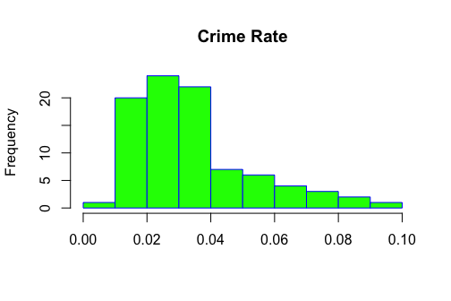

We note that the distribution of the `crmrte` variable has a clear positive skew as count variables often do. Additionally, a boxplot reveals that five counties have crime rates that are potential mild outliers. This skew makes logical sense in that we know that by definition crime rates must be positive, and we also expect a certain subset of counties to have larger rates than others:

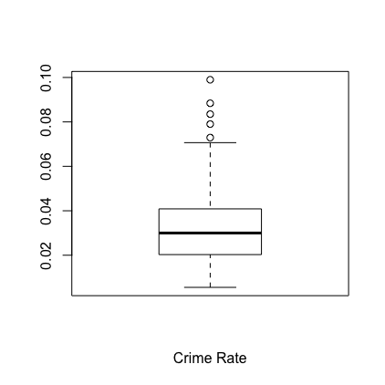

A quantile-quantile plot of a log-transformed version of the `crmrte` variable reveals close conformity with a normal distribution. As a result, in order to better uncover linear relationships between `crmrte` and our independent variables, we will consider a log transform of `crmrte` when preparing our models. This follows from the aforementioned skew in particular, but also from lack of negative values in the count variable:

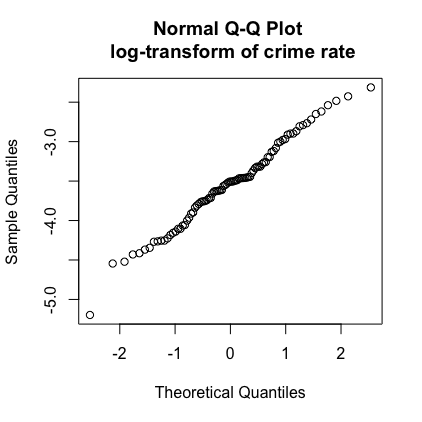

### `prbarr`, `prbconv`, `prbpris`:

The probability of arrest variable, `prbarr`, is proxied by the ratio of arrests to offenses in a given county. Because of the inputs to this ratio, the result does not always conform to range between zero and one. Therefore, it is not a true probability, but rather an empirical proxy. We note that only one value of `prbarr` is greater than one, although it is significantly higher than all other values. This apparent outlier value could convey important information about a particular county and therefore should not be excluded. In the county associated with this value, "over arresting" is contributing to the lowest crime rate (min(`crmrte`)==0.0055332) of any of the counties in our data:

``` r
nrow(raw_data[raw_data$prbarr > 1.0, ])
```

    ## [1] 1

``` r
summary(raw_data$prbarr)
```

    ##    Min. 1st Qu.  Median    Mean 3rd Qu.    Max. 
    ## 0.09277 0.20495 0.27146 0.29524 0.34487 1.09091

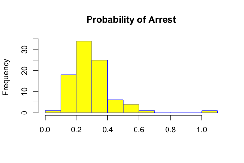

In similar fashion, the probability of conviction variable, `prbconv`, is a ratio of convictions to arrests, indicating some form of conditioning given arrest or *follow-through* to a conviction. The values for this variable also exhibit the same departure from a traditional probability that we noted in `prbarr`, except this time we see the `prbconv` variable exceeds 1.0 in 10 of the 90 records.

``` r
nrow(raw_data[raw_data$prbconv > 1.0, ])
```

    ## [1] 10

``` r
summary(raw_data$prbconv)
```

    ##    Min. 1st Qu.  Median    Mean 3rd Qu.    Max. 
    ## 0.06838 0.34422 0.45170 0.55086 0.58513 2.12121

This is likely the result of criminals receiving convictions for multiple crimes associated with a single arrest, which acts as a potential measure of the "harshness" of prosecutors or the broader judicial process. It could also be a result of the severity of the offenses being committed. Out of these 10, 7 are in the lower 25% (within 1st quantile) of `cmrte`:

``` r
sum(raw_data$crmrte[which(raw_data$prbconv>1.0)]<0.020604)
```

    ## [1] 7

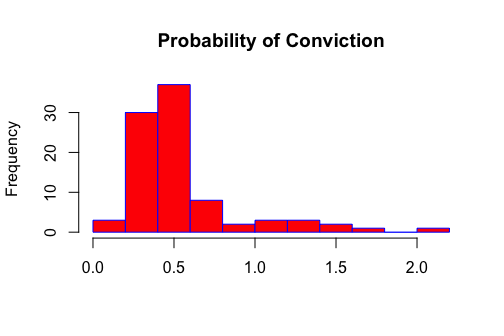

Unlike the `prbarr` and `prbconv`, the probability of prison sentence variable, `prbpris`, contains values that conform to a range consistent with a probability. This makes intuitive sense, considering jail time without a conviction is virtually impossible:

``` r
summary(raw_data$prbpris)
```

    ##    Min. 1st Qu.  Median    Mean 3rd Qu.    Max. 
    ##  0.1500  0.3642  0.4222  0.4106  0.4576  0.6000

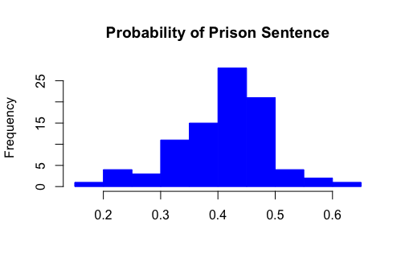

While these three ratios are not a perfect proxy for probabilities, they nevertheless convey useful information and we will not alter the values by normalizing them. We feel that at least one of these variables will have useful predictive power in our models.

Before moving on, it is important to note a very interesting bond that these variables share: together they attempt to operationalize the concept of *deterrence* and its impact on crime rates.

#### `avgsen`:

It seems reasonable that if a criminal were to have a good grasp of the true probability of arrest, conviction, and prison sentence before committing a crime, then that knowledge could serve as a crime deterrent. However, it is a little more challenging to make the same argument for the average sentence, `avgsen` variable.

Sentences vary with the type and circumstances of a crime. They also vary according to the judge delivering the sentence. Given the range of sentence lengths, a simple average might not be the best method to capture a deterrence effect. In other words, criminals likely care about whether they would be sentenced and what sentence length they could face for a given crime, rather than average sentences across all possible crimes they could commit. Combining these factors results in a loss of valuable information. As a result, we do not anticipate the `avgsen` variable will have much predictive power in a model predicting crime rate.

#### `polpc`:

Rounding out the list of deterrence factors is the police per capita, `polpc`, variable. We would expect this variable to potentially carry meaningful information in relation to `crmrte`, given that police are responsible for making arrests:

``` r
summary(raw_data$polpc)
```

    ##      Min.   1st Qu.    Median      Mean   3rd Qu.      Max. 
    ## 0.0007459 0.0012378 0.0014897 0.0017080 0.0018856 0.0090543

A summary of the `polpc` variable reveals that the max value is much larger than the rest of the distribution. While such a large value could be indicative of an error, we lack sufficient background information related to this variable to effectively justify deleting it, or coverting it through imputation. Given that this anomaly might represent a legitimate signal in the data, we will remain skeptical of its value but leave it as presented.

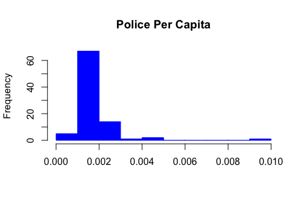

    ## [1] 51

    ## [1] 51

Note the similarity in this distribution with what we saw in the distribution of `prbarr`. Each distribution has one clear outlier, and if we compare the rows that these outlier values appear in for each variable, we find that they correspond to the same county with ID \#115. This hints at a possible correlation (*ρ*<sub>*a**r**r**e**s**t*,  *p**o**l**i**c**e*</sub> = 0.43) between `polpc` and `prbarr` to keep in mind when specifying a model. This makes intuitive sense, since the probability of a criminal being arrested should increase if more police are present.

#### `density`:

In addition to deterrence measures, this dataset also attempts to explain crime rates through *socioeconomic* factors. The first of these is the `density` variable, which represents people per square mile. A summary of this variable reveals something odd: the numbers seem very small. This is probably due to scaling (e.g. hundreds):

``` r
summary(raw_data$density)
```

    ##    Min. 1st Qu.  Median    Mean 3rd Qu.    Max. 
    ## 0.00002 0.54718 0.97925 1.43567 1.56926 8.82765

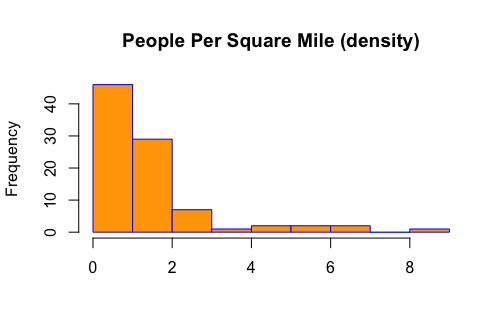

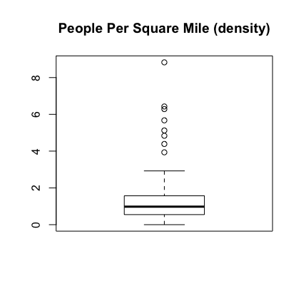

While the shape of the distribution looks reasonable, the maximum value of approximately 8.8 does not seem consistent with what we would expect for the highest density areas in the state (e.g., large urban areas), unless it is indeed just a scaling issue.

#### `taxpc`:

Tax revenue per capita, `taxpc`, is another socioeconomic factor that we anticipate might have some predictive power in our models. Intuitively, it is reasonable to assume that counties with higher tax revenue per capita might be more affluent and that this affluence might increase the crime rate.

However, the opposite condition seems plausible too: counties with lower tax revenue per capita might represent non-affluent citizens and also be associated with increased crime rates.

These opposing relationships, if actually represented in the data, could result in tax revenue per capita only providing marginal benefit to a predictive model, as the effect could go either way. However, the benefit of this measure is that it provides the clearest proxy for *income* in our data set from a socioeconomic perspective. Other variables such as weekly wages per sector (more below) are not normalized at the county or per capita level. The correlation with `crmrte` is *ρ*<sub>*t**a**x*,  *c**r**i**m**e*</sub> = 0.45, which suggests the first hypothesis may be at play: more affluent areas tend to experience more crime.

#### `west`, `central`, `urban`:

The `west`, `central`, and `urban` variables attempt to bin the county data into larger regional groups. It is unclear why these bins were chosen, but the intent appears to be related to a desire to capture a geographic effect on crime.

It is hard to imagine how these higher-level groupings could provide more explanatory power than previously mentioned factors that represent lower-level (more granular) associations with crime. In fact, these bins might actually be trying to capture a relationship between region and crime that is already accounted for in the `density` variable. `density` is better suited for this task, as it is already a normalized measure at the county level.

#### `pctmin80`:

The percent minority variable, `pctmin80`, records what proportion of the population of a county were minorities as of 1980. This is hardly informative because it does not tell us the proportion of criminals who are minorities. Given no other evidence, we have no reason to believe that members of minority groups are naturally predisposed to be criminals.

In other words, if a county has a high crime rate, as well as a high proportion of minorities, the two measures do not imply that minorities are committing more crimes or that minorities drive the crime rate up. Nonetheless, we recognize that this could be a proxy for other factors such as education levels (what is commonly referred to as the "achievement gap" in the United States). We believe the rational perspective is that members of minority groups likely commit crimes according to similar socioeconomic causal factors as non-minority criminals.

It is not ideal that we got these percentages for 1980 instead of 1987 when other data was gathered. However, for this type of socioeconomic variable, it is likely that the proportion of minorities under a 7-year timeframe (probably within 10-year census windows) has not meaningfully changed.

#### Weekly Wage Variables (`wcon`, `wtuc`, `wtrd`,`wfir`, `wser`, `wmfg`, `wfed`, `wsta` and `wloc`):

The data set contains 9 variables that provide weekly wage averages for various occupation categories. Without understanding in more detail the distribution of workers associated with each job category in a given county, it is difficult to justify including these variables. If we were trying to get to some measure of *income*, `taxpc` appears as a cleaner measure overall.

We have no reason to believe that workers in certain job categories are more prone to committing crime, similar to our thoughts on `pctmin80`. As a result, we do not expect these variables to have very high predictive power

#### `mix`:

The `mix` variable represents the proportion of face-to-face crime encounters with crimes of all other encounter types. It seems that the motivation behind this variable is related to a desire to assess a criminal's comfort level committing crimes in a particular county.

Ultimately, when compared to previously mentioned factors, this does not seem like a variable that will have much power for predicting crime rates. While it is the closest proxy we have to *types* of crimes committed relative to other variables, the face-to-face delimitation appears broad and not granular enough.

#### `pctymle`:

The percent young male variable, `pctymle`, describes the proportion of a county's population that is both male and between the ages of 15 and 24. Like the percent minority variable, this variable seems like an attempt to describe what members of a population are more likely to commit crimes.

In the absence of any other demographic factors, this variable might only provide marginal benefit to a predictive model. Even if we find an association with crime rate, we still do not know what proportion of young males actually commit crime. Similar to `pctmin80`, it could be a proxy for education level or other unobserved variables, without establishing direct age-crime causality. This may be an instance of potential missing variable bias to be aware of.

4) Hypothesis and Proposed Model Specifications:
------------------------------------------------

Before specifying a particular model, we developed a hypothesis, analyzed the available variables, and considered which ones made practical sense to be included in our model.

**Main Hypothesis:**

Our intuition led us to believe that a comprehensive yet parsimonious model should focus on *deterrence* and *socioeconomic* factors, in order to guide policy ahead. With this in mind, we selected the following 5 key variables for our first model:

*Deterrence:*

1.  Probability of arrest (`prbarr`) - Given a higher chance of being arrested, we would expect a lower crime rate

2.  Probability of conviction (`prbconv`) - Proposing that arrests alone are necessary but not sufficient as a *deterrent* of crime

3.  Police per Capita (`polpc`) - Seen as an enabler of the aforementioned two variables, a higher police presence per capita should lead to lower crime

*Socioeconomic:*

1.  People per sq. mile (`density`) - From a *socioeconomic* perspective, a higher population per square mile would be expected to capture higher urbanization where we see crime as empirically concentrated

2.  Tax Revenue per Capita (`taxpc`) - The higher the revenue of an area, the lower crime rate we would expect in the majority of cases

A scatterplot for these variables, together with their corresponding correlations, is the best way to understand their interrelationships:

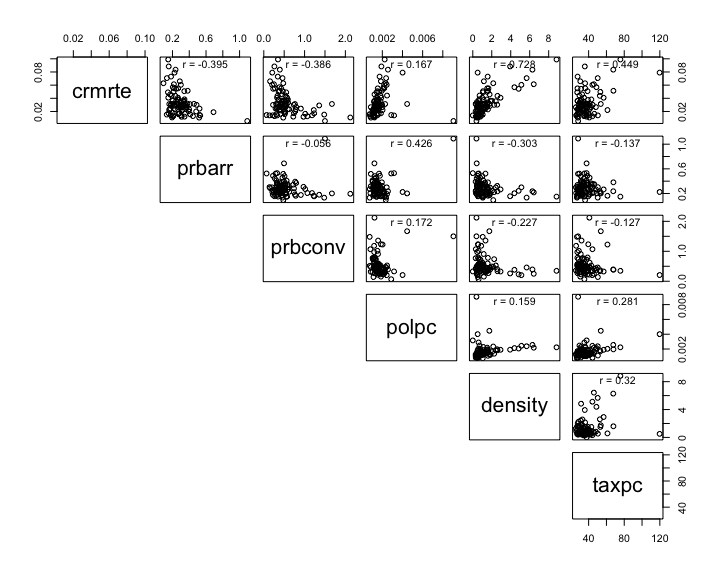

As predicted, there is a negative relationship between crime rate, `crmrte`, and probability of arrest, `prbarr`, in a county. This makes intuitive sense, as the criminals in a county with high arrest rates might be more careful in this county or even commit crimes in other counties, knowing there is less chance of being arrested there. The correlation between these two is *ρ*<sub>*c**r**i**m**e*,  *a**r**r**e**s**t*</sub> = −0.395.

The probability of conviction, `prbconv`, is also negatively correlated with `crmrte`, at about the same degree as the probability of arrest. Together, these two appear to effectively operationalize what we conceptually refer to as *deterrence*, that is, an associated actual punishment given a crime has been committed. Additionally, the correlation among these two variables is just *ρ*<sub>*a**r**r**e**s**t*,  *c**o**n**v**i**c**t**i**o**n*</sub> = −0.056 , which could bode well for our model, as this lack of redundancy would not lead to multicollinearity.

We see there is a slightly positive correlation between `crmrte` and police per capita `polpc`, which is the opposite of what we would have expected. Additionally, the correlation between `polpc` and `prbarr` appears a bit high at *ρ*<sub>*a**r**r**e**s**t*,  *p**o**l**i**c**e*</sub> = 0.426. This of course makes intuitive sense, given police are responsible for making arrests. This suggests a potential multicollinearity among `polpc` and `prbarr`, which should be tested for during final model selection. However, we prefer to keep the variable as our intuition reaffirms its validity. The presence of police does not imply arrests, although arrests implies police presence. For this reason, we prefer to represent a more complete picture on the *deterrence* side by including this variable, despite the aforementioned weak correlation with `cmrrte` (yet somewhat higher with `prbarr`).

Next, we indeed observe a strong correlation between `density` and `crmrte`, which conforms to our initial intuition on this relationship. The larger the population of a given county, the more opportunity there is for crime and likely the harder it gets for regulation as well. The correlation with crime rate is *ρ*<sub>*c**r**i**m**e*,  *d**e**n**s**i**t**y*</sub> = 0.728. As previously noted, this is more of a *socioeconomic* factor.

Finally, we can see that there is a positive correlation between crime rate, `crmrte`, and a county's tax revenue per capita, `taxpc`. This relationship could suggest that more crime would be commited in areas where there are wealthier individuals/businesses, although we must be mindful of its correlation with `density`. For the time being, this provides what we see as our best proxy for *income*, so we prefer to include the variable. However, we also experimented with different combinations of the weekly wage variables as potential alternative metrics, but in absence of data defining the specific labor force composition for each county, none of these adjustments appeared to be a reasonable measure. Therefore, we believe the tax revenue per capita is the best available variable to address the relationship between a county's wealth and crime rate.

Model 1 below incorporates these key variables. Yet in order to explore broader models we may have missed under our initial intuition and exploration, we calculate a more comprehensive correlation matrix across all variables.

### Correlation Matrix:

To analyze other variables' effects on our model, we run a correlation matrix over all variables considered as potentially important. For this, we remove `year` and `county`, as well as the weekly wage variables, which we feel would add little to the model:

    ## Loading required package: ggplot2

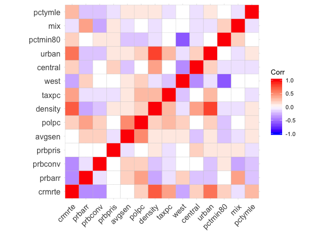

The correlation matrix reinforces some key relationships we had initially surmised, as well as some covariates we had not initially considered. The first observations are the strong positive correlation between crime rate `crmrte` and `density`, as well as strong negative correlations between crime rate and both probability of arrest `prbarr` and probability of conviction `prbconv`.

One observation that stands out immediately is the high correlation between `urban` and `crimerate`, which does make sense, as urban areas do tend to have more crime. Rather than jumping to the conclusion that this should be an important variable to include, we then also see a strong relationship between `urban` and `density` at *ρ*<sub>*u**r**b**a**n*,  *d**e**n**s**i**t**y*</sub> = 0.820. This is a strong positive correlation that would almost certainly lead to multicollinearity among these two variables, hence it does not make sense to include `urban` even in less parsimonious versions of our model.

We also see that the `west` variable has a negative correlation with `crimerate`, which indicates crime is lower in western counties. While this is an interesting fact, we would rather prioritize underlying (more granular) factors that could happen to occur more frequently in that region. It is a far-fetched claim to make that crime will automatically be higher simply because we are considering the Western part of the state of North Carolina.

Finally, we can see two aditional variables that stand out: percent young male `pctymle` and percent minority in 1980 `pctmin80`. The correlations of these two variables with crime rate are *ρ*<sub>*y**o**u**n**g**M*,  *c**r**i**m**e*</sub> = 0.290 and *ρ*<sub>*m**i**n**o**r**i**t**y*,  *c**r**i**m**e*</sub> = 0.182, respectively. These relationships could indicate that counties that have more minorities and/or higher percent young males would expect to have higher crime rates. Fundamentally, we don't have a strong reason to bias against these demographic groups, but they could be proxies for a separate "core" missing variable such as education levels per county. We will consider these as such in broader specifications of our model (Models 2 and 3 below). The correlation between these two variables is almost 0 at *ρ*<sub>*y**o**u**n**g**M*, *m**i**n**o**r**i**t**y*</sub> = −0.019, so we do not need to worry about redundancy when including both in our model.

### Regression Modeling:

Based on our univariate and bivariate explorations, coupled with our logical analysis on factors that could lead to crime, we ran four models and observed their coefficients. We also explored regressing over the log transform of `crmrte` as well, but results were broadly consistent (at least before analyzing errors and CLM assumptions, more below). More thorough analysis of residuals, whether to actually transform the dependent variable, and other CLM assumptions are discussed in the following section.

1.  **Model 1: Key Variables (x5)** - Our first model includes only the key variables we had initially chosen:

``` r
model_1 <- lm(crmrte ~ prbarr + prbconv + polpc + density + taxpc, data=raw_data)
#summary(model_1)
```

1.  **Model 2: Key Variables (x5) + Covariates (x2)** - Our second model includes our key variables from Model 1, as well as covariates that we believe increase the accuracy of our results per the above discussion of broader correlations and potential proxies for missing variables:

``` r
model_2 <- lm(crmrte ~ prbarr + prbconv + polpc + density + taxpc + pctymle + pctmin80,
              data=raw_data)
#summary(model_2)
```

1.  **Model 3: All Variables ex-Wages (x13)** - The third model looks at all covariates with the exception of weekly wage data, which appears to contribute the least in differentiating crime across counties as presented and discussed:

``` r
model_3 <- lm(crmrte ~ prbarr + prbconv + polpc + density + taxpc + pctymle + pctmin80 +
                      prbpris + avgsen + west + central + urban + mix, data=raw_data)
#summary(model_3)
```

1.  **Model 4: All Variables (x22)** - Last, we look at a model that includes all the independent variables, in order to evaluate robustness of alternative specifications with less parameters:

``` r
df <- subset(raw_data, select=-c(county, year))
model_all <- lm(crmrte ~ ., data=df)
#summary(model_all)
```

We present all coefficients side-by-side with robust errors, for the sake of caution before we formally test the assumption of homoskedasticity:

    ## 
    ## Please cite as:

    ##  Hlavac, Marek (2018). stargazer: Well-Formatted Regression and Summary Statistics Tables.

    ##  R package version 5.2.2. https://CRAN.R-project.org/package=stargazer

% Table created by stargazer v.5.2.2 by Marek Hlavac, Harvard University. E-mail: hlavac at fas.harvard.edu % Date and time: Sun, Dec 23, 2018 - 18:09:31
Overall, Model 2 represents our best and most honest current understanding of the factors impacting crime for potential policy messaging. Conceptually, we want to capture variables not only pertaining relevant *deterrence* and *socioeconomic* factors, but which are also actionable policy-wise. The only variables in Model 2 that do not appear directly actionable policy-wise, but which later became apparent as potentially relevant proxies for something else (e.g. education) are `pctmin80` and `pctymle`.

In the following section, we test the Classical Linear Model (CLM) assumptions of our main model, Model 2.

5) Testing CLM Assumptions:
---------------------------

The 6 assumptions to test are: \[1\] Linear Population Model, \[2\] Random Sampling, \[3\] No Perfect Multicollinearity, \[4\] Zero-Conditional Mean (or at least Endogeneity), \[5\] Homoskedasticity, and \[6\] Normality of Errors.

We will proceed with testing each assumption on Model 2, but will note interesting takeways while testing these assumptions on our other models.

### \[1\] Linear Population Model:

We have not constrained the error term in any of our models, hence we do not really have to check something meaningful here. Linearity in parameters stands.

### \[2\] Random Sampling:

There were 100 counties in North Carolina in 1987. We have data on 90 of them. While we do not know exactly what process was undertaken to sample these, we have data on most of them. This challenges to some extent the unbiasedness and hence our ability to make a causal interpretation of our models. However, we believe that there may still be valuable associative claims for driving policy in North Carolina specifically.

### \[3\] No Perfect Multicollinearity:

During our variable selection process, we explored what made intuitive sense individually, while checking for redundancy across variables. As can be seen below, we do not observe any perfect correlations between Model 2 variables:

``` r
# Correlation matrix of variables in 'Model 2':
model_2_corr <- subset(raw_data,
                       select= c(prbarr, prbconv, polpc, density,
                                 taxpc, pctymle, pctmin80))
model_2_corr_matrix <- cor(model_2_corr)
model_2_corr_matrix <- round(model_2_corr_matrix, 2)
lower <- model_2_corr_matrix
lower[lower.tri(model_2_corr_matrix, diag=TRUE)] <- ""
lower <- as.data.frame(lower)
(lower)
```

    ##          prbarr prbconv polpc density taxpc pctymle pctmin80
    ## prbarr            -0.06  0.43    -0.3 -0.14   -0.18     0.05
    ## prbconv                  0.17   -0.23 -0.13   -0.16     0.06
    ## polpc                            0.16  0.28    0.05    -0.17
    ## density                                0.32    0.12    -0.07
    ## taxpc                                         -0.09    -0.03
    ## pctymle                                                -0.02
    ## pctmin80

Also, R did not warn us when running any of the models as it would. The following variance inflation test further quantifies how much collinearity is there in Model 2:

``` r
# VIF for 'Model 2':
library(car)
```

    ## Loading required package: carData

``` r
vif(model_2)
```

    ##   prbarr  prbconv    polpc  density    taxpc  pctymle pctmin80 
    ## 1.969074 1.382107 2.045186 1.444747 1.381327 1.190653 1.081045

Overall, there is no perfect multicollinearity in Model 2, nor a worrisome level of collinearity that would keep the CLM valid but with a loss of precision. Only `parrest` and `polpc` show a higher correlation vs. other pairs, but we do not see it at a level that requires adjustment (all VIFs&lt;4 and their mean value &lt; 2).

We performed the same tests in our other models, and while none of them showed perfect multicollinearity, the only variables that showed a high degree of collinearity, as expected, were `density` and `urban`. These were included in Model 3 and Model 4.

### \[4\] Zero-Conditional Mean:

We look at the residual vs fitted diagnostic plot for Model 2:

``` r
# Residuals vs. fitted for 'Model 2':
plot(model_2, which=1)
```

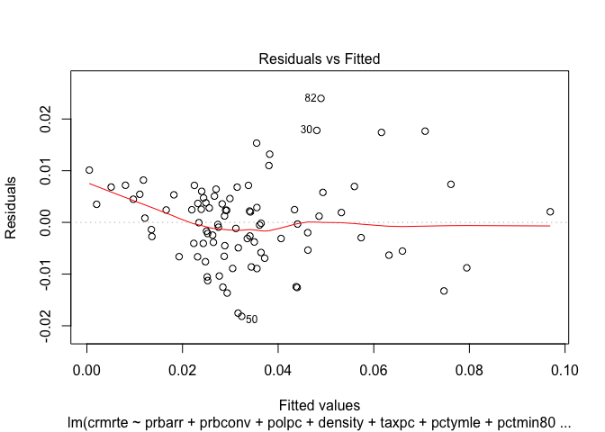

Although on less data points, we observe some departure from a zero-conditional mean assumption on the left side of our plot, which corresponds to smaller fitted values around `crmrte`. As we had suspected before, based on the distribution of `log(crmrte)`, it might be worth exploring the same model on a log transformation of our dependent variable. We call this model 'Model 2 Log':

``` r
# Running log-transformed model 'Model 2 Log':
model_2_log <- lm(log(crmrte) ~ prbarr + prbconv + polpc + density + taxpc + pctymle + pctmin80,
                  data=raw_data)
```

It is important to note that now that we are shifting to the log transform, the interpretation of our model will be on a percentage change of `crmrte` basis. This is actually a more appropriate metric intuitively as well, as it is more tangible to assess the percentage change of crime rate, rather than an absolute value of `crmrte` as our dependent variable. We now evaluate again whether our zero-conditional mean assumption holds under the log transformed model:

``` r
# Residuals vs. fitted for 'Model 2 Log':
plot(model_2_log, which=1)
```

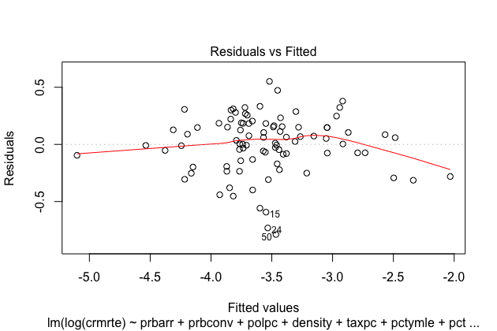

Overall, we believe our zero-conditional mean assumption is more reasonable under this model. While the right side of the plot still shows a slight deviation, we think this is a bit less pronounced than that of our previous model and prefer to make this our primary model. It is important to note that there is a trade-off here fit-wise, as the transformed model has a slightly lower adjusted r-square than the original model. Here is a comparison of their adjusted r-square values:

``` r
# Comparing fit between 'Model 2' and 'Model 2 Log':
summary(model_2)$adj.r.square
```

    ## [1] 0.8082467

``` r
summary(model_2_log)$adj.r.square
```

    ## [1] 0.7690895

We observe that there is a (4%) decline in this measure of fit. We consider this a reasonable trade-off because our new model aligns better with the assumptions of the CLM. Here is a comparison with robust errors (unless the upcoming homoskedasticity test suggests otherwise, we default to robust) of 'Model 2' and 'Model 2 Log':

% Table created by stargazer v.5.2.2 by Marek Hlavac, Harvard University. E-mail: hlavac at fas.harvard.edu % Date and time: Sun, Dec 23, 2018 - 18:09:31
While the magnitude of the coefficients adjusts given the transformation, the signs do not. This is encouraging, as it speaks to the robustness of our coefficients. We are currently focused on satisfying the assumptions of the CLM as best as we can and will elaborate more on what this means for interpretation ahead.

Finally, we evaluated residuals vs. fitted plots for other models. While the degree of deviation from the zero-mean line appeared comparable, we prefer how 'Model 2 Log' is centered around the bulk of our data with about equal number of observations on each side (i.e. outcome data appears less clustered with greater expressed overall dispersion across range).

### \[5\] Homoskedasticity:

Based on the same residual vs. fitted plot from above, 'Model 2 Log' appears reasonably homoskedastic, in particular when we compared it to other models. In order to more formally evaluate this, we will look at both a Scale-Location plot of transformed residuals and conduct a Breusch-Pagan (BP) Test.

We start with the Scale-Location plot for 'Model 2 Log':

``` r
plot(model_2_log, which=3)
```

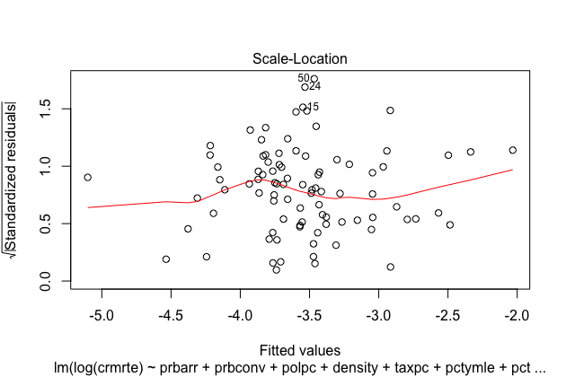

Based on this plot, we can observe a slight "kink" around the fitted values closer to -3.8. Otherwise, the plot appears reasonable in testing if our residuals are indeed homoskedastic. On the right side of the plot, we observe some deviation. However, these are largely based on 1-2 observations. We will inspect whether any particular observations have undue influence ahead, but we focus on homoskedasticity here with the BP Test:

``` r
# BP Test 'Model 2 Log':
library(lmtest)
```

    ## Loading required package: zoo

    ## 
    ## Attaching package: 'zoo'

    ## The following objects are masked from 'package:base':
    ## 
    ##     as.Date, as.Date.numeric

``` r
bptest(model_2_log)
```

    ## 
    ##  studentized Breusch-Pagan test
    ## 
    ## data:  model_2_log
    ## BP = 10.986, df = 7, p-value = 0.1392

We observe that with a p-value of 0.1392, we fail to reject the null hypothesis that our 'Model 2 Log' is indeed homoskedastic. This in turn sets us on a decent track to satisfy the conditions of the Gauss-Markov theorem for our OLS estimates to not only be Unbiased (assumptions 1-4, if fulfilled), but also to potentially represent the Minimum Variance Unbiased Estimate (MVUE, or "BLUE"" for Best Linear) of our coefficients of interest.

We also ran a BP Test for 'Model 2' for comparison:

``` r
# BP Test 'Model 2':
library(lmtest)
bptest(model_2)
```

    ## 
    ##  studentized Breusch-Pagan test
    ## 
    ## data:  model_2
    ## BP = 17.537, df = 7, p-value = 0.01424

As we can see, it rejects the null hypothesis of homoskedasticity for that other model, which sheds further light on how shifting our interpretation to the log of crime rate `log(crmrte)` (as a proxy for % change) instead of `crmrte` directly was beneficial.

All other models also failed the BP Test, similar to 'Model 2' as shown.

### \[6\] Normality of Errors:

In order to test this last assumption of our Classical Linear Model, we show both a Normal QQ-plot and a histogram of residuals for 'Model 2 Log'. This assumption should give us further precision beyond just validity, with the ability to understand the sampling distribution of our coefficients and be able to test hypotheses on them:

``` r
plot(model_2_log, which=2)
```

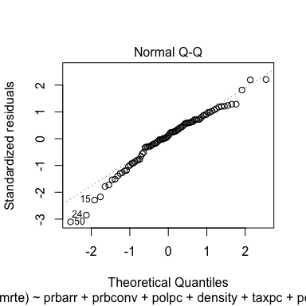

``` r
hist(model_2_log$residuals,
     main="Histogram of 'Model 2 Log' Residuals",
     xlab="Residuals")
```

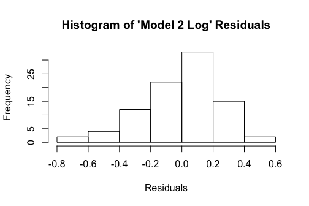

Our distribution of residuals is not perfectly normal, exhibiting some left skew (*m**e**a**n* = 0 by design yet *m**e**d**i**a**n* = 0.03). However, we do not believe this is meaningful enough to constitute dismissing this assumption or changing the model altogether. Part of the degree of comfort stems from the 90 observations in our sample and the limited skewness of both our transformed dependent variable and the residuals themselves. An unskewed or moderately skewed distribution should more efficiently arrive to the conclusions of the Central Limit Theorem (CLT). However, we are mindful of not making an asymptotic claim explicitly, because there is a finite number of counties in North Carolina, most of which can be found in our data set.

While evaluating other models under this assumption, we noticed much larger deviations from normality in both their QQ-plots and histogram equivalents.

As a last diagnostic area, we also evaluated whether any particular point has a Cook Distance &gt;1 indicating what could be seen as undue influence in our coefficient estimates. Here are the results for 'Model 2 Log':

``` r
plot(model_2_log, which=5)
```

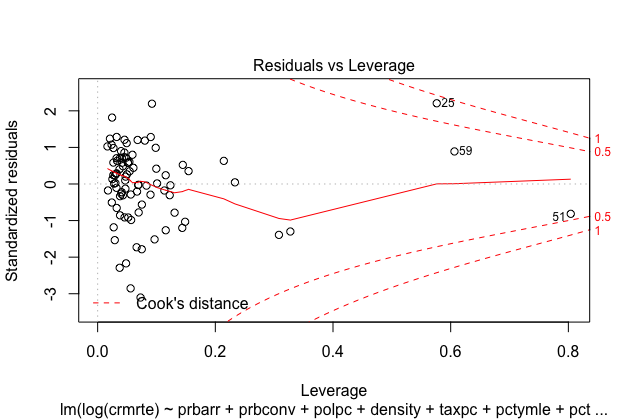

``` r
plot(model_2_log, which=6)
```

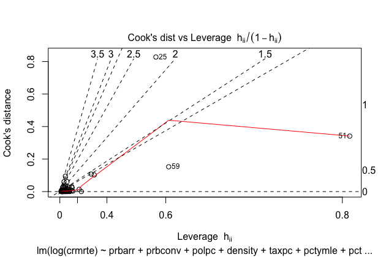

Zooming on the residuals vs. leverage plot first, we observe that no single point lies above the *C**D* = 1 threshold of undue influence. Observation \#25 comes close, but it doesn't quite surpass the boundary. While evaluating this sample plot for other models, we did observe some violations in this regard. As it pertains to both influence and leverage in the influence vs. leverage plot, we can further observe points of interest. Again, observation \#25 has an elevated influence as measured by Cook's Distance, although not at an "undue" level (above 1). We also highlight points \#51 and \#59. Point \#51 has the greatest leverage of all, but is not exerting influence as it relates to actual deviation from what our fitted line is otherwise.

We investigated these three observations and found the following: - \#25 corresponds to County ID 55 and has `log(crmrte)` on higher end - \#51 corresponds to County ID 115 and has the minimum extreme value on the dependent variable - \#59 corresponds to County ID 133 and has `log(crmrte)` on higher end too, similar to \#25

Covariate-wise: - `prbarr` =&gt; \#51 max value (1.09091), else reasonable in range (as highlighted in EDA) - `prbconv` =&gt; \#25 and \#59 on lower end of regressor distribution, while \#51 one of highest values at 1.50 - `polpc` =&gt; nothing to highlight - `density` =&gt; nothing to highlight - `taxpc` =&gt; only \#25 max value of regressor - `pctymle` =&gt; point \#59 max value of regressor - `pctmin80` =&gt; only \#25 min value of regressor

Below is an analysis of each point relative to others, attempting to describe why leverage is present (not necessarily actual influence): - \#25 is probably a high income county relative to others with max taxes, minimum minority - \#51 probably corresponds to a more heavily secured area (max deterrent) with minimum crime - \#59 has high crime similar to \#25 relative to other counties, but it aligns more logically with the story the coefficients are capturing on all observations (point has leverage but no considerable influence)

In summary, we would like to note we did not include transformations of independent variables. This is because while observing these variables, both on an un-transformed basis and at least on a log-transformed basis, it did not appear to us that the marginal benefits of increased variability (wider range of expression) or de-skewness merited keeping their transformed versions. We did not feel like it made logical sense either, given that some of the dependent variables are already in percentage terms.

Overall, we consider 'Model 2 Log' to reasonably follow the assumptions of CLM. We next focus on the interpretation of the coefficients in the context of policy for our campaign.

6) Model Interpretation and Potential Policy Proposals:
-------------------------------------------------------

We evaluate each resulting coefficient in relation to our dependent variable `log(crmrte)` with the objective of linking our proposed model to potential policy recommendations for our campaign trail. It is important to note we have a semi-log model with a log transformation on our dependent variable, but no transformations on our independent variables:

`prbarr`: Our first coefficient relates to a *deterrence* measure as probability of arrest. We anticipated the sign of our coefficient to be negative (which it is) given that with greater probability of getting arrested, crime rate should intuitively diminish. The coefficient of -2.120 suggests that for every unit increase in the probability of arrest, a large increase for a probability, the percentage change in `crmrte` itself would be "very roughly" about -200%. We say "very roughly" because we understand this approximation is valid for values below 10% primarily, but the large statistical and practical effects appear clear.

`prbconv`: The second coefficient operates similarly to the first one, although more from a "full follow-through" perspective post arrest. We would expect the probability of conviction to also have a negative effect on crime rate, and it does with a coefficient of -0.716. This means that for every unit increase in our probability of conviction as measured in our data set (again a large increase for a probability), we would expect, on average, a reduction of about about -70% in `crmrte`. Both of these factors were statistically significant at a 0.1% level under a robust errors approach, which now appears conservative given our BP Test failed to reject our homoskedasticity assumption as the null hypothesis of the test.

`polpc`: The sign of the police per capita coefficient appears a bit counterintuitive at first sight when compared to the previous two variables in our model. We originally expected that an increased amount of police would lead to lower crime. However, the sign of our coefficient is actually positive at 171.142 (large number from units of measurement as police per inhabitant). This means that if we were to increase police force by 1 policeman per inhabitant, the effect would be exacerbated in duplicating the population with all police force! We hypothesize that so far, police penetration has acted more as a reactive variable than vice versa, as in counties could add police as a response to crime, rather than proactively putting police in place and keeping it at relatively elevated levels once crime declines (*ceteris paribus*). Under this light, the positive relationship with our dependent variable becomes more intuitive in thinking how as `crmrte` increases or decreases, police response also increases or decreases. The 171.42 number would associate one unit increase per inhabitant of the average county as a quite large reponse to crime rate. This coefficient was significant under robust errors at a 1% confidence level.

`density`: We see that density has a relatively smaller positive coefficient, but it appers that the units of measurement impact this relative to other coefficients. As we noted in our exploratory analysis, we suspect this variable may actually be in thousands or another multiple of population, although we are unable to verify this with the information provided. As described, the coefficient of 0.116 suggests that on average each person added to the county per square mile associates with crime rate rising about +12%. The sign of the coefficient aligns with what we expected before we ran any model in terms of more populated areas generally having higher crime rates, empirically. This coefficient was also significant under robust errors at a 1% level, similar to police presence above, but not as much as the probabilities of arrest and conviction. From a practical significance standpoint, `density` also appears as a highly significant factor. It carried a correlation of 0.728 with `crmrte` which agreed with our initial empirical suspicion. In spite of this relationship, it might be difficult to influence `density` through policy. Government would have difficulties actually impacting how many people live per square mile (where people decide to live, work, or else). However, `density` can at least help identify counties to focus on and its inclusion in the model isolates the associated urbanization effect from potentially impacting other coefficients.

`taxpc`: The tax per capita coefficient of 0.002 implies a change in `crmrte` of about +0.2% per unit increase in tax per capita. This variable was not significant under our original model, and it remained insignificant in the log-transformed version. While the effect appears small, the fact that the coefficient is positive suggests that counties with more tax revenue would expect a higher crime rate. In spite of its lack of statistical significance, we have kept this variable in order to capture the *socioeconomic* effect of income. We believe that income should be represented somehow. We consider this our best proxy from the variables provided, in particular when compared to the unnormalized wage variables.

`pctymle`: The coefficient for `pctymle` is not assessed to be statistically significant. Without additional information related to types of crimes and demographics of criminals in the counties our data represents, it is difficult to defend why this variable should, or should not, be predictive of crime rates. As previously noted, we believe this variable, together with `pctmin80`, may represent a proxy for education level. We have no data on education level and consider it as a potentially important missing variable, but the model appears to reject `pctymle` under the log transformation. The coefficient of 1.554 would imply a unit increase in the percentage of males in a county leads to (roughly) +155% higher crime rate in the average county, as measured by `crmrte`.

`pctmin80`: Finally, we see that the percent minority variable has a positive and statistically significant coefficient in our model at a 0.01% level. The 0.012 coefficient implies that for every unit increase in the percertange of minority population in a county, as measured in 1980 at least, we could expect an average increase of about +1.2% in `crmrte`. Again, with no amplifying information about the demographics of the criminals in each county it would be difficult to justify a causal link between minorities and crime rates. It is much more reasonable that an omitted variable bias is responsible for the relative influence of this coefficient in the model, such as education. A more detailed set of demographic and socioeconomic factors would be useful for evaluating this suspicion as we address in the Alternative Data section.

Given our exploration, hypothesis, model, testing of assumptions and interpretation of coefficients together with their relative robustness, we propose the following set of policies for the campaign trail:

**Policy \#1 \[Short-Term / Deploying Surveillance Technology\]:** The *deterrent* effect of `prbarr` on `crmrte`appears considerable together with follow-through as `prbconv`. On the other hand we recognize more police per capita `polpc` isn't necessarily the solution. As a result, we believe that better surveillance technology could offer an alternative where the effect of deterrence is there without making it about more police in the streets. For example, New York City has installed cameras in public places that do not represent a violation of privacy. We also believe in the value of pursuing this idea as a campaign focus because it has the added benefit of making the budget more efficient (i.e. decreases the need for paying salaries to an ever larger police force).

**Policy \#2 \[Medium-Term / Assessing Education Levels\]:** We suspect the reason `pctmin80` is significant relies on it being a proxy for other *socioeconomic* factors. While this suggestion requires further study, we believe there is good value in investigating the relationship between `crmrte` and education levels in particular. Empirically, we believe that measures of education level would better describe relative crime rates and offer a path towards designing programs for improvement. Assuming there is indeed such relationship, these programs would ideally result in keeping students off the streets and reducing `crmrte`. One tangible example includes the implementation of after-school programs with this relationship in mind.

**Policy \#3 \[Long-Term / Prioritizing on Density\]:** While we cannot control or influence the `density` of a county in the short-term, it tends to associate strongly with `crmrte`, so we can at least prioritize resources in denser areas of the state. In order to drive greater impact over the long term, we must first ensure that police departments in denser areas get the necessary resources. When our candidate visits more populated counties on the campaign trail, we believe it is important to have conversations with local police departments and learn what could be driving `crmrte` beyond just more people per square mile. Is it about the types of crime? Is it about local gangs to focus on? Identifying what could be actually influenced by policy, beyond the demographic phenomenon alone, would prove beneficial in placing our study into further context for these key areas.

7) Alternative Data:
--------------------

The data set provided contains relevant information with the intent of modeling crime rate through two primary categories of information: *deterrence* factors and *socioeconomic* factors. While this is a good representation of the overall problem, we believe that the approach can be improved. The dataset contains several factors that are good predictors of crime rate and can be reasonably justified as intuitive components of a predictive model. However, we do not feel that any of the models are complete representations of the determinants of crime. As a result, there likely exist omitted variable biases in some of the coefficients. With some additional information, we could potentially mitigate these biases. We present some ideas as to what could enrich our analysis.

Overall, we assess that omitted *socioeconomic* factors are the most likely sources of bias in our model results. We view these omitted factors as falling into three sub-categories in particular: income level, local job market, and education.

Income is not well represented in the data we analyzed and we think it could matter, or at the very least be explored more thoroughly. Our models would benefit from having additional variables that combine to provide a more cohesive financial representation of the population in a given county. Good candidate variables might include: \[1\] `average wage across all workers in a county`, \[2\] `average housing cost`, and \[3\] `pct of county sub poverty level (income inequality)`. If any of these variables were to have a negative relationship with crime rate, we could expect them to offset existing positive biases in our coefficient estimates. For instance, tax revenue per capita could flip signs as a coefficient. The converse would apply as well. Assuming that lower income leads to material need, and thus to crime, \[1\] and \[2\] could have a negative correlation with crime rate, while \[3\] a positive one. Up to this point, we have primarily used tax rate per capita as a proxy for income, because the 9 weekly wage variables provided appear inapplicable without the corresponding distribution of sectors. Unlike the wage variables, the proposed metrics represent more normalized measures at the county level.

Our data is also lacking factors that describe the job market in each county, such as \[4\] `unemployment rate` and \[5\] `assessments of economic growth`. Such factors could potentially provide valuable context to frame our interpretation of crime rate. In other words, the relationship between the unemployment rate and crime rate might contribute to a better understanding of the relationship between job availability and crime rate changes. For example, it is reasonable to expect that counties with higher unemployment rates would suffer from higher crime rates. Similarly, economic growth could impact how the job market in a county is moving and would be a useful metric to use in relation to crime rate. If a county is experiencing high levels of job openings, we may see a decline in crime rate as a "gentrification effect" may be taking place. Areas that experience an influx in jobs tend to also see increasing restaurant and retail store openings in the area, along with an increase in rent. As cost of living increases, we would expect to see an increase in safety/regulation to suppress crime rate. Therefore, an unemployment rate variable would likely have a positive correlation with crime rate, so we estimate this omitted variable could offset existent negative bias on coefficient estimates for job-related variables that are present in our models. Alternatively, while economic growth might have an oscillatory effect, on average we expect it would likely have a negative correlation with crime rate. As a result, we estimate inclusion of economic growth would offset positive bias on current coefficient estimates for job-related variables in our models.

Finally, we believe that a set of educational factors would be a useful addition to our data. For example, we suspect that both \[6\] `high school graduation rates` and \[7\] `literacy rates` have meaningful relationships with crime rates. If we want to understand the determinants of crime, then we need more variables that shed light on the propensity to commit crime not as *deterrents*, but rather as *socioeconomic* motivators. Educational factors are necessary for this task because they will allow us to gain a more robust understanding of the socioeconomic landscape where criminals come from. A failure to graduate high school, or being illiterate, limits the ways an individual can participate in the economy. If these limits influence the likelihood of criminal behavior, then we would not want to leave them out of a crime rate prediction model. We anticipate that a high school graduation rate variable, as well as a literacy rate variable, would likely have a negative correlation with crime rate. We estimate these omitted variables could either offset any negative biases in current specification or shed light on `pctmin80` and `pctymle` the covariates we have associated with this area.

In summary, these suggested *socioeconomic* omitted variables may affect our conclusions because we suspect *deterrence* factors alone cannot fully explain increases or decreases in crime rates. We hypothesize that socioeconomic factors initially drive crime rates up or down, and deterrence has a dampening effect. In other words, tracing the problem to its origin requires an understanding of socioeconomic factors. Therefore, we would prefer additional data that could better capture the relative influence between these two categories.

8) Conclusion:
--------------

Through this research and policy proposal, we have uncovered some of the key factors that could potentially explain crime rates in North Carolina. We believe these variables can primarily be lumped into two important categories of influence: *deterrence* and *socioeconomic*.

We initially hypothesized that the probability of arrest `prbarr`, the probability of conviction `prbconv`, police presence per capita `polpc`, population density `density`, and tax revenue per capita `taxpc` (as a measure of income) would serve as good predictors of crime rate `crmrte`. While these factors helped us develop an initial model, we realized that these alone do not tell the entire story. In particular, additional covariates such as percentage of young male in population `pctymle` and percentage minority `pctmin80` provide a more complete socioeconomic picture. We believe these primarily serve as a proxy for education level. These combined factors resulted in Model 2 as our "core" model before testing assumptions of the CLM.

Upon testing these assumptions, we opted for a log transformation of our dependent variable as Model 2 Log. The transformation not only improved the model's compliance with the assumptions, but it also made practical sense to interpret the dependent variable as a percentage change in crime rate. Our policy suggestions around Deployment of Surveillance Technology, Assessment of Education Level and Prioritizing Density originated from the interpretation of this model's results. We view these recommendations as an important initial step, but we acknowledge that further study of potentially missing variables must be done. For example, we believe that a more thorough understanding of *socioeconomic* variables pertaining to income level, job market conditions, and education level would be beneficial.
